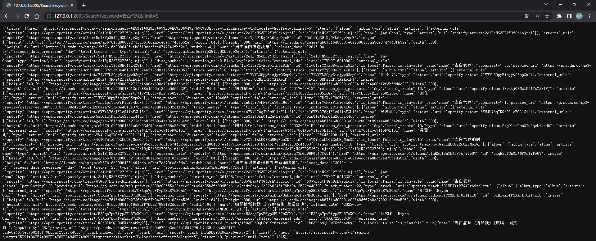

# 获取搜索数据

> **调用示例:** `/Search?keyword=告白气球&limit=5`

> **返回数据:**

## 参数

* `keyword 搜索关键词`
* type 搜索类型 默认为track  
    1. album 专辑
    2. artist 艺术家
    3. playlist 播放列表
    4. track 歌曲
    5. show 未知
    6. episode 插曲
    7. audiobook 有声读物
* limit 返回数量 默认为10  
    最大值为50
* offset 页数 默认为0  
    最大值为1000