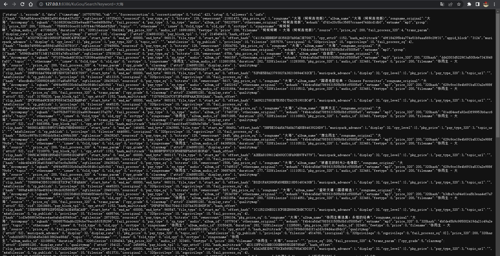
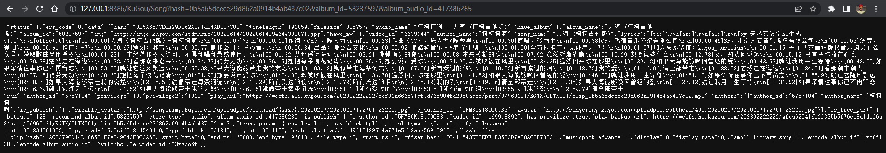

# 酷狗音乐API

## 搜索

> **调用示例:** `/KuGou/Search?keyword=大海`

> **返回数据:**

## 参数

* `keyword搜索关键词`

* limit 返回数量 默认为10  

* offset 页数 默认为1

## 获取音乐信息

> **调用示例:** `/KuGou/Song?hash=0b5a65dcece29d862a0914b4ab437c02&album_id=58237597&album_audio_id=417386285`

> **返回数据:**

## 参数

* hash 每首歌曲的Hash

* album_id 每首歌曲的Album_id

* album_audio_id 每首歌曲的Album_audio_id